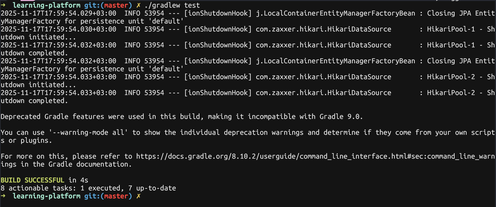

# Learning Platform

## Требования

- Java 21+

## Документация

Краткое описание:
- Все главные сущности лежать в модуле core. Там лежат и все необходимые тесты бизнес логики. Предполагается, что этот модуль можно использовать как библиотеку для создания приложения: WEB, DESK, CLI или любого другого
- В модуле app находится только проверка работы с spring web и запуск data.sql
- Проект собирается с помощью gradle. Чтобы быстро проверить работоспособность, можно запустить `./gradlew test`
- Для настройки базы данных необходимо локально исправить конфигурацию внутри файлов:
    - [app/main/application.properties](./app/src/main/resources/application.properties)
    - [core/main/application.properties](./core/src/main/resources/application.properties)
    - [core/test/application.properties](./core/src/test/resources/application.properties)

### Структура проекта

Модули проекта:
- core: хранит domain и data слои (entity, repository, service). **Здесь реализована обязательная часть практической работы**
- app: запускает spring приложение, тестирует использование data.sql

Модуль core имеет классическую структуру:
- entity
- repository
- service
- dto

Архитектуру проекта можно посмотреть в файле [core_architecture.puml](./docs/core_architecture.puml):


### Тестирование

Запуск unit-тестов и интеграционных тестов:

```bash
./gradlew :core:test
```

Результаты:



Для тестирования data.sql (тестового наполнения данными):

```bash
./gradlew :app:bootRun
```

Результат:


## Схема базы данных

За основу была взята предложенная в задании схема, но с минорным изменениями:


> Также можно посмотреть исходный файл [plantuml](./docs/db_scheme.puml)

