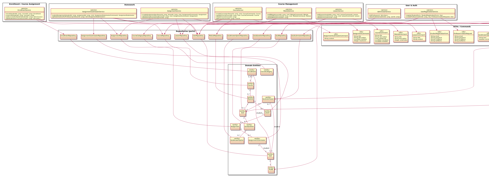
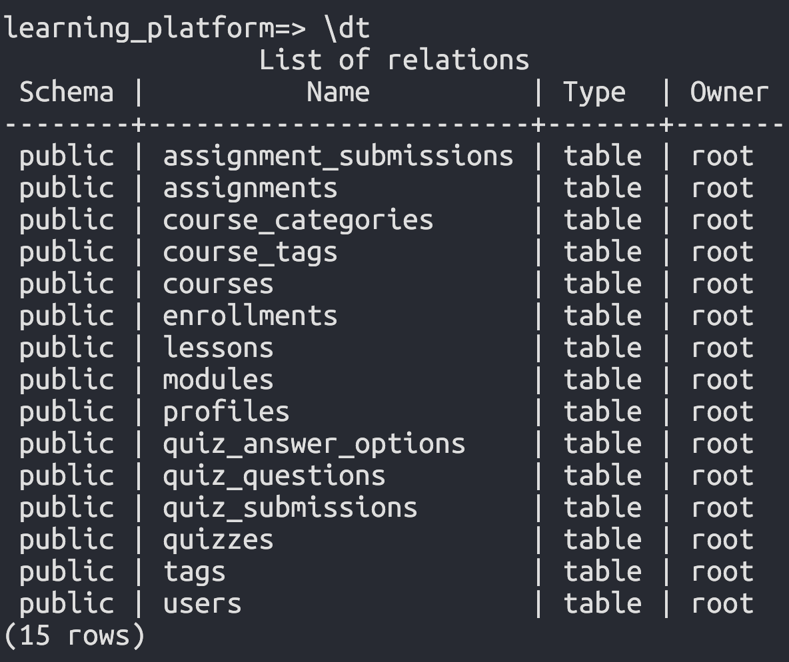
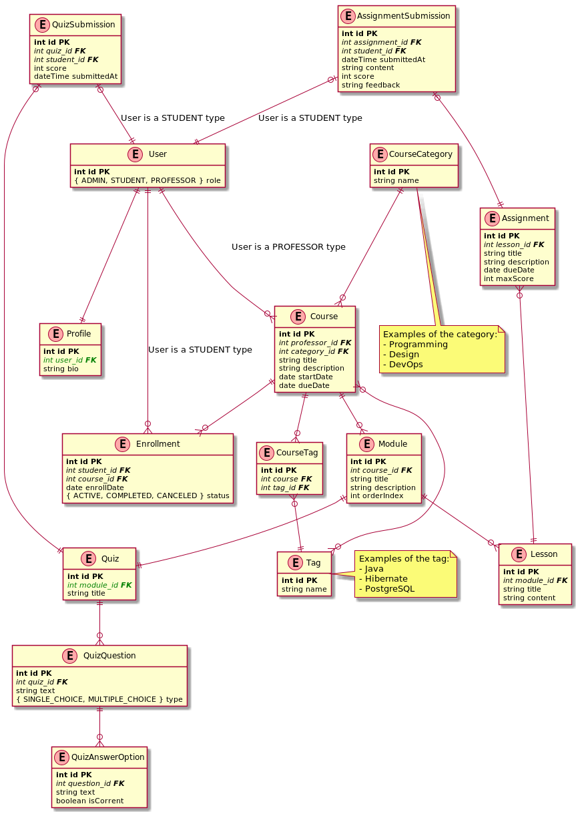

# Learning Platform

## Требования

- Java 21+

## Документация

### Структура проекта

Модули проекта:
- core: хранит domain и data слои (entity, repository, service). **Здесь реализована обязательная часть практической работы**
- app: запускает spring приложение, тестирует использование data.sql

Архитектуру проекта можно посмотреть в файле [core_architecture.puml](./docs/core_architecture.puml):



### Тестирование

Запуск unit-тестов для core модуля:

```bash
./gradlew :core:test
```

Результаты:


Для тестирования data.sql (тестового наполнения данными):

```bash
./gradlew :app:bootRun
```

Результат:



## Схема базы данных

За основу была взята предложенная в задании схема, но с минорным изменениями:



> Также можно посмотреть исходный файл [plantuml](./docs/db_scheme.puml)

