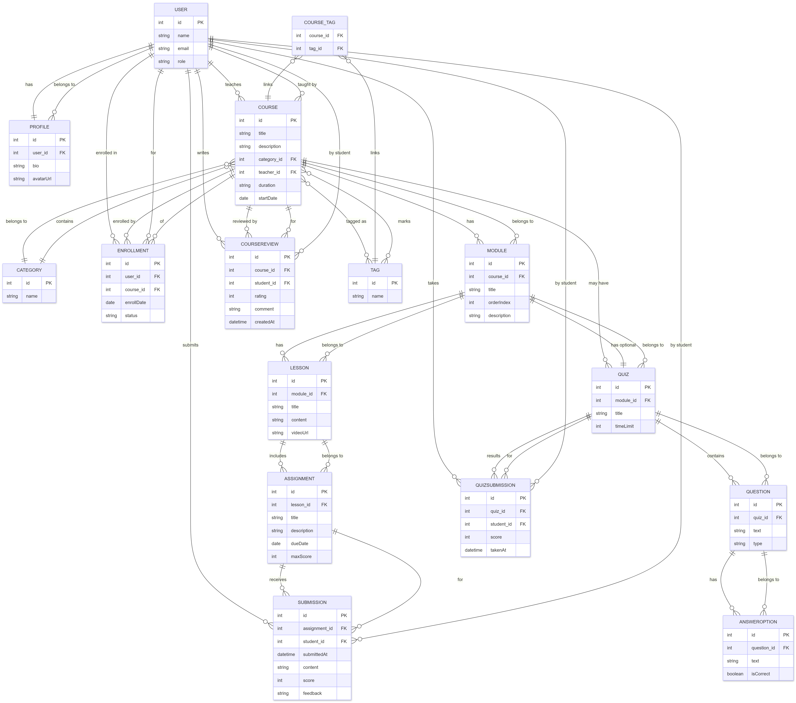

# Tech Task

**Task**: Create a web application that have to support storing of the course structure and learning materials, managing of users (professors and students), managing of study processes (applying for a course, pushing of homework tasks, passing tests)

**What Have to be Done**:
- architect a database structure
- develop an API to support business logic
- business logic integration tests

**Tech Stack**:
1. Java 17+
2. Spring Boot, Spring Data JPA
3. Hibernate (JPA)
4. PostgreSQL
5. Gradle

